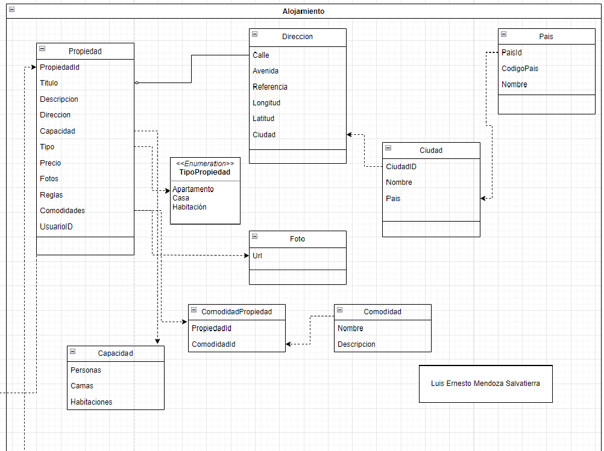

# Microservicio Alojamiento

Microservicio encargado de la gestión de propiedades, casos de uso relacionados con las propiedades. Proporcionar todas las funciones necesarias para administrar y operar propiedades de alojamiento, como apartamentos, casas y habitaciones, en la plataforma. Agregar su dirección, fotos, reglas y comodidades.


## Diagrama




## API Reference

### Crear propiedad

```http
  POST /api/Propiedad/CrearPropiedad
```
#### Request
```json
{
  "titulo": "Propiedad 2",
  "descripcion": "Descripcion 2",
  "precio": 20,
  "tipoPropiedad": 0,
  "personas": 10,
  "camas": 5,
  "habitaciones": 5
}
```
#### Reponse
```json
"63e3623d-5896-4b4e-a5d6-4f7e2d55b106"

```

### Agregar dirección

```http
  POST /api/Propiedad/AgregarDireccion
```
#### Request
```json
{
  "propiedadId": "72bb5a1a-59fd-479c-9ba7-362838019fc3",
  "calle": "Calle desconocida",
  "avenida": "Avenida siempre viva",
  "referencia": "Porton café",
  "latitud": -17.794154056549296,
  "longitud":  -63.16394929715153,
  "ciudadId": "c563650f-a70d-433c-8022-a453813efe4a"
}
```
#### Reponse
```json
"63e3623d-5896-4b4e-a5d6-4f7e2d55b106"

```

### Agregar fotos

```http
  POST /api/Propiedad/AgregarFotos
```
#### Request
```json
{
  "propiedadId": "72bb5a1a-59fd-479c-9ba7-362838019fc3",
  "fotos": [
    {
      "url": "https://hips.hearstapps.com/hmg-prod/images/one-bed-cottage-for-sale-bath-1674727199.jpg"
    }
  ]
}
```
#### Reponse
```json
"63e3623d-5896-4b4e-a5d6-4f7e2d55b106"

```

### Agregar reglas

```http
  POST /api/Propiedad/AgregarReglas
```
#### Request
```json
{
  "propiedadId": "3806aa9d-4f61-402a-873f-7fac9cbd180b",
  "reglas": [
    {
      "value": "No se permiten mascotas"
    }
  ]
}
```
#### Reponse
```json
"63e3623d-5896-4b4e-a5d6-4f7e2d55b106"

```

### Agregar comodidades

```http
  POST /api/Propiedad/AgregarComodidades
```
#### Request
```json
{
  "propiedadId": "72bb5a1a-59fd-479c-9ba7-362838019fc3",
  "comodidades": [
    "f0350c4e-2e79-4d72-986b-549313cdf149"
  ]
}
```
#### Reponse
```json
"63e3623d-5896-4b4e-a5d6-4f7e2d55b106"

```

### Agregar comodidad

```http
  POST /api/Comodidad
```
#### Request
```json
{
  "nombre": "Area de parrilla",
  "descripcion": "Area de parrilla"
}
```
#### Reponse
```json
"f0350c4e-2e79-4d72-986b-549313cdf149"

```

### Busca propiendad por ciudad

```http
  GET /api/Propiedad/BuscarPropiendadXCiudad?ciudadTerm="SAnta Cruz"
```
#### Reponse
```json
[
  {
    "titulo": {
      "value": "Propiedad 3"
    },
    "descripcion": {
      "value": "Descripcion 3"
    },
    "precio": {
      "value": 20
    },
    "direccion": {
      "propiedadId": "72bb5a1a-59fd-479c-9ba7-362838019fc3",
      "calle": "Calle desconocida",
      "avenida": "Avenida siempre viva",
      "referencia": "Porton café",
      "latitud": -17.794154056549296,
      "longitud": -63.16394929715153,
      "ciudad": {
        "name": "Santa Cruz",
        "country": null,
        "id": "c563650f-a70d-433c-8022-a453813efe4a",
        "domainEvents": []
      },
      "id": "914292ed-d61a-42db-ab97-7a0248244a8c",
      "domainEvents": []
    },
    "capacidad": {
      "people": 10,
      "beds": 5,
      "rooms": 5
    },
    "tipoPropiedad": 0,
    "fotos": [
      {
        "url": "https://hips.hearstapps.com/hmg-prod/images/one-bed-cottage-for-sale-bath-1674727199.jpg",
        "id": "3807cb9c-0577-4a80-b448-4fcb95996cce",
        "domainEvents": []
      }
    ],
    "reglas": [],
    "comodidades": [
      {
        "comodidadId": "f0350c4e-2e79-4d72-986b-549313cdf149",
        "id": "70e16cbd-0a9a-4651-af1d-730010491daa",
        "domainEvents": []
      }
    ],
    "id": "72bb5a1a-59fd-479c-9ba7-362838019fc3",
    "domainEvents": []
  },
  {
    "titulo": {
      "value": "Propiedad 1"
    },
    "descripcion": {
      "value": "Descripcion 1"
    },
    "precio": {
      "value": 200
    },
    "direccion": {
      "propiedadId": "1f4266ea-945c-459d-8d2a-4b2e6e0c0bb5",
      "calle": "Calle 1",
      "avenida": "Avenida 1",
      "referencia": "Referencia 1",
      "latitud": -17.798352608310086,
      "longitud": -63.14190154084186,
      "ciudad": {
        "name": "Santa Cruz",
        "country": null,
        "id": "c563650f-a70d-433c-8022-a453813efe4a",
        "domainEvents": []
      },
      "id": "cad6f4b7-891f-42a6-90b2-002e8d10c791",
      "domainEvents": []
    },
    "capacidad": {
      "people": 10,
      "beds": 5,
      "rooms": 5
    },
    "tipoPropiedad": 0,
    "fotos": [
      {
        "url": "https://images.adsttc.com/media/images/5771/cc2a/e58e/ce0a/2700/007f/large_jpg/CASAU_CROQUIS_03.jpg?1467075583",
        "id": "bf4413cf-ea73-40d7-8717-a7a9b4e12510",
        "domainEvents": []
      }
    ],
    "reglas": [
      {
        "value": "Regla 1",
        "id": "0d469738-3cbb-4268-13ee-08db980a859d",
        "domainEvents": []
      }
    ],
    "comodidades": [
      {
        "comodidadId": "e6527034-f33f-4c0c-917c-343ab298f4d2",
        "id": "49f858d6-ddd5-43f7-b03e-224645a3c8ab",
        "domainEvents": []
      }
    ],
    "id": "1f4266ea-945c-459d-8d2a-4b2e6e0c0bb5",
    "domainEvents": []
  },
  {
    "titulo": {
      "value": "Propiedad 3"
    },
    "descripcion": {
      "value": "Descripcion 3"
    },
    "precio": {
      "value": 20
    },
    "direccion": {
      "propiedadId": "3806aa9d-4f61-402a-873f-7fac9cbd180b",
      "calle": "Calle desconocida",
      "avenida": "Avenida siempre viva",
      "referencia": "Porton café",
      "latitud": -17.794154056549296,
      "longitud": -63.16394929715153,
      "ciudad": {
        "name": "Santa Cruz",
        "country": null,
        "id": "c563650f-a70d-433c-8022-a453813efe4a",
        "domainEvents": []
      },
      "id": "47a41a50-3f6f-4f73-b41f-53f4ce9bb8af",
      "domainEvents": []
    },
    "capacidad": {
      "people": 10,
      "beds": 5,
      "rooms": 5
    },
    "tipoPropiedad": 0,
    "fotos": [
      {
        "url": "https://hips.hearstapps.com/hmg-prod/images/one-bed-cottage-for-sale-bath-1674727199.jpg",
        "id": "c6b878dc-bedb-487f-ad39-80b42f78bd89",
        "domainEvents": []
      }
    ],
    "reglas": [
      {
        "value": "No se permiten animales",
        "id": "f8bfc99a-7be1-400d-f260-08db9877d96f",
        "domainEvents": []
      },
      {
        "value": "No se permiten mascotas",
        "id": "b58355b7-e34b-4eeb-9583-08db987b8c78",
        "domainEvents": []
      }
    ],
    "comodidades": [
      {
        "comodidadId": "03030dc6-5c83-4bd3-bdd7-fd50698f78c9",
        "id": "9cf09db4-b278-407a-9fc4-905cdb751a47",
        "domainEvents": []
      }
    ],
    "id": "3806aa9d-4f61-402a-873f-7fac9cbd180b",
    "domainEvents": []
  }
]

```

## Demo

https://youtu.be/Ah5FqVbL3-0


## Authors

- [@LuismendozaSalv](https://github.com/LuismendozaSalv)

